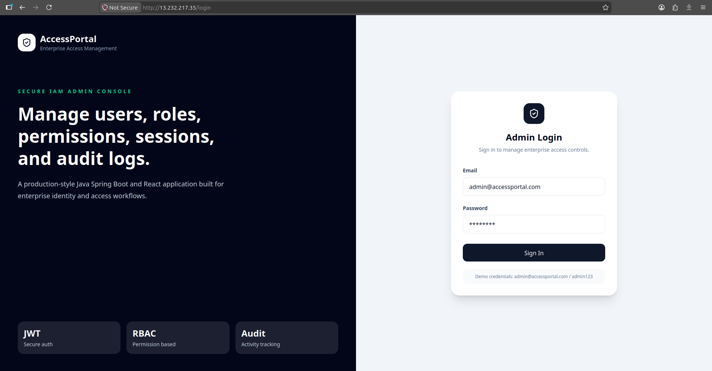
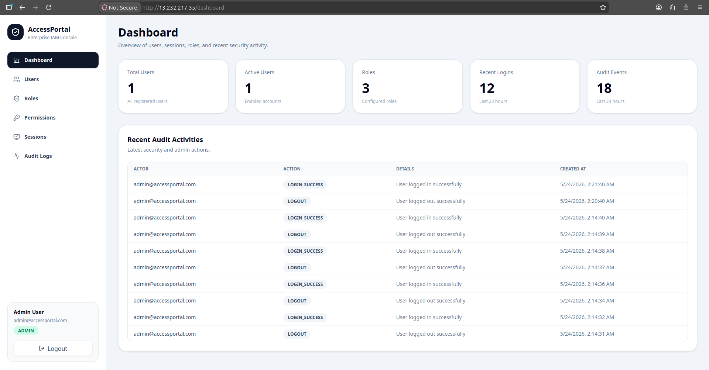
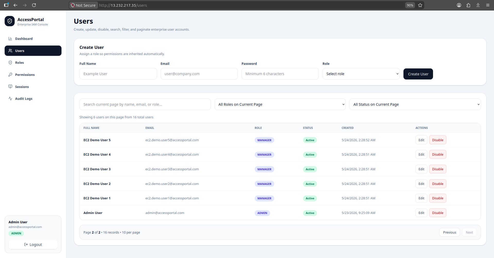
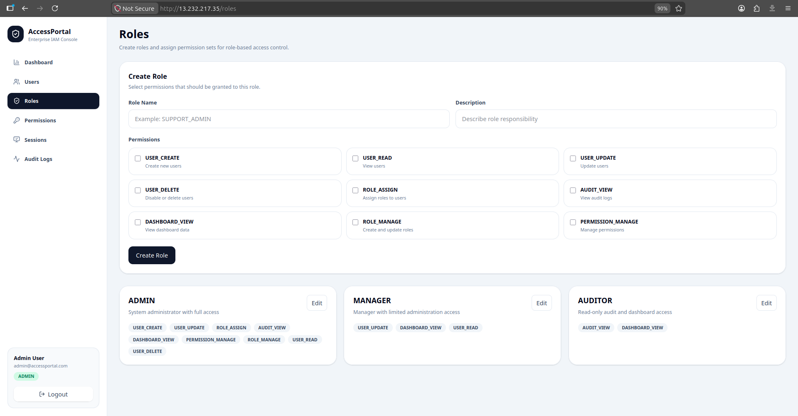
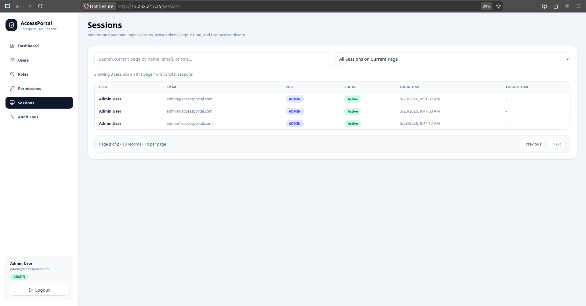
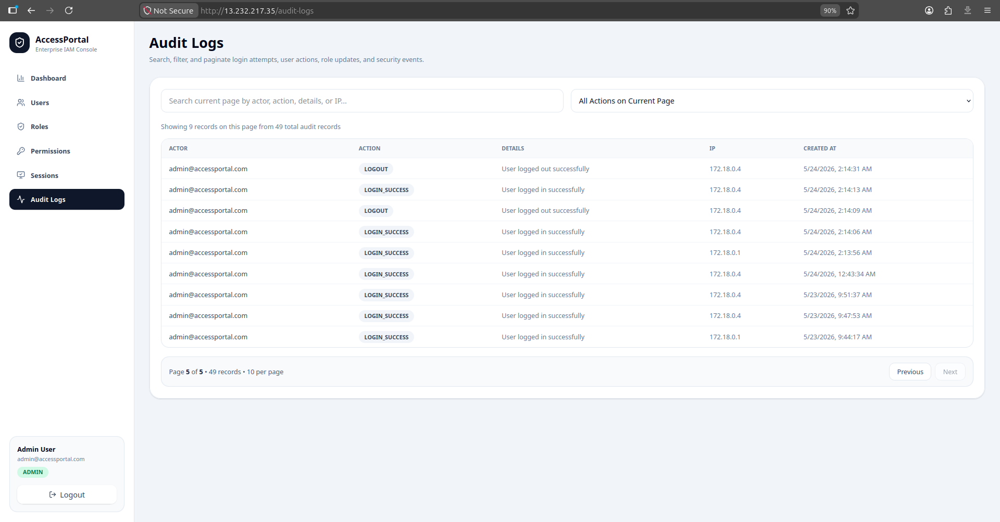
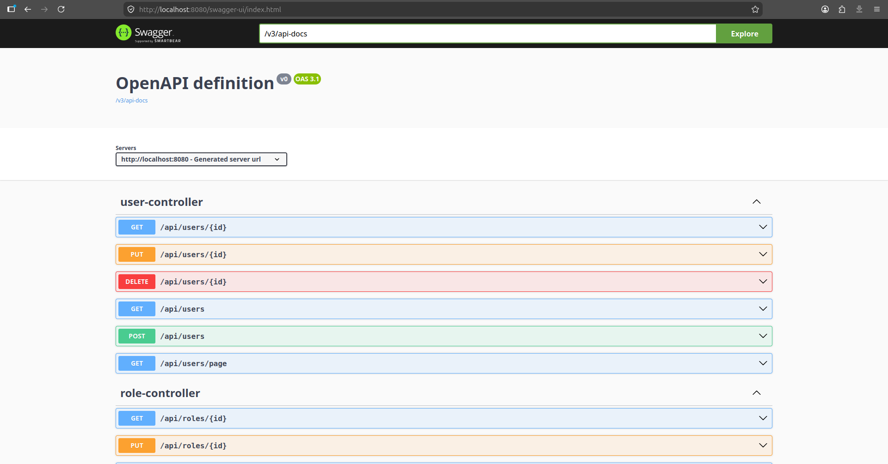
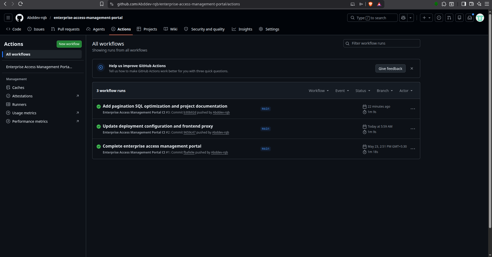
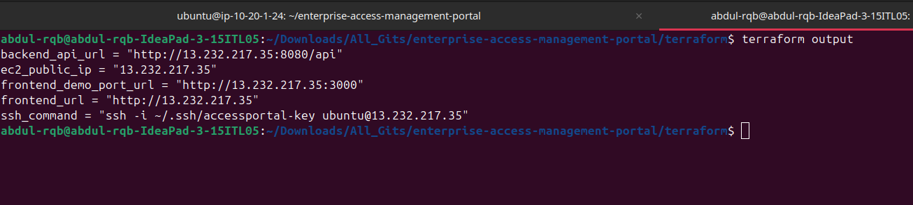

# Enterprise Access Management Portal

A production-style **Identity and Access Management admin console** built with **Java Spring Boot, React, PostgreSQL, Docker, Terraform, and AWS EC2**.

This project demonstrates secure full-stack development through authentication, authorization, RBAC, session tracking, audit logging, dashboard metrics, pagination, SQL optimization, CI, testing, Dockerized deployment, and AWS infrastructure provisioning.

---

## Why This Project Exists

Enterprise systems need secure access control. This project solves that problem by giving admins a centralized portal to manage:

- Users
- Roles
- Permissions
- Login sessions
- Dashboard metrics
- Audit logs
- Security activity

The goal was not only to build CRUD screens, but to build a realistic access-management workflow similar to internal enterprise IAM tools.

---

## Live Deployment

The application was deployed on **AWS EC2 using Terraform and Docker Compose**.

```text
Frontend: http://13.232.217.35/login
Backend:  http://13.232.217.35/api
````

Demo credentials:

```text
Email:    admin@accessportal.com
Password: admin123
```

> Note: The public EC2 URL may be stopped after demonstration to avoid AWS charges.

---

## Proof of Work

### 1. Login Page



### 2. Dashboard



### 3. Users Management with Pagination



### 4. Roles and Permission Assignment



### 5. Session Monitoring



### 6. Audit Logs



### 7. Swagger API Documentation



### 8. GitHub Actions CI



### 9. AWS Terraform EC2 Deployment



---

## Core Features

### Authentication and Security

* JWT login
* JWT token validation
* BCrypt password hashing
* Stateless Spring Security configuration
* Protected REST APIs
* Protected React routes
* Role-based sidebar rendering
* Permission-based UI visibility
* Logout with session invalidation

### User Management

* Create users
* View users
* Update users
* Disable users
* Assign roles to users
* Paginated users table
* Search and filter users by role/status

### Role and Permission Management

* Create roles
* Update roles
* Assign permissions to roles
* View system permissions
* Permission-based authorization using Spring Security

### Session Management

* Session created on login
* Session marked inactive on logout
* Login time tracked
* Logout time tracked
* Active/inactive sessions displayed
* Paginated sessions table
* Session expiry audit job

### Audit Logging

Audit logs are created for:

* Login success
* Login failure
* Logout
* User created
* User updated
* User disabled
* User role assigned
* Role created
* Role updated
* Role permission updated
* Session expired

### Dashboard

The dashboard displays:

* Total users
* Active users
* Roles count
* Recent login count
* Recent audit count
* Recent activity list

---

## Tech Stack

### Frontend

* React.js
* JavaScript ES6+
* JSX
* React Hooks
* React Router
* Axios
* Tailwind CSS
* Vite
* React Hook Form
* Zod
* Vitest
* React Testing Library

### Backend

* Java 17
* Spring Boot
* Spring Web
* Spring Security
* Spring Data JPA
* Hibernate
* JWT Authentication
* Maven
* JUnit 5
* Mockito

### Database

* PostgreSQL
* Flyway migrations
* SQL indexes for optimized querying

### DevOps and Deployment

* Docker
* Docker Compose
* Nginx reverse proxy
* Terraform
* AWS EC2
* GitHub Actions CI
* Postman
* Swagger / OpenAPI

---

## Architecture

```text
Browser
  ↓
React Frontend
  ↓
Nginx Reverse Proxy
  ↓ /api
Spring Boot REST API
  ↓
Spring Security + JWT
  ↓
Spring Data JPA / Hibernate
  ↓
PostgreSQL
```

AWS deployment:

```text
Terraform
  ↓
Custom VPC + Public Subnet + Security Group
  ↓
AWS EC2 Ubuntu Instance
  ↓
Docker Compose
  ↓
Frontend + Backend + PostgreSQL Containers
```

---

## Main API Endpoints

### Authentication

```text
POST /api/auth/login
POST /api/auth/logout
GET  /api/auth/me
```

### Users

```text
GET    /api/users
GET    /api/users/page?page=0&size=10
GET    /api/users/{id}
POST   /api/users
PUT    /api/users/{id}
DELETE /api/users/{id}
```

### Roles

```text
GET  /api/roles
GET  /api/roles/{id}
POST /api/roles
PUT  /api/roles/{id}
```

### Permissions

```text
GET /api/permissions
```

### Sessions

```text
GET /api/sessions
GET /api/sessions/active
GET /api/sessions/page?page=0&size=10
```

### Audit Logs

```text
GET /api/audit-logs
GET /api/audit-logs/page?page=0&size=10
```

### Dashboard

```text
GET /api/dashboard
```

---

## Database Design

Main tables:

```text
users
roles
permissions
role_permissions
audit_logs
user_sessions
```

Seeded roles:

```text
ADMIN
MANAGER
AUDITOR
```

Seeded permissions:

```text
USER_CREATE
USER_READ
USER_UPDATE
USER_DELETE
ROLE_ASSIGN
AUDIT_VIEW
DASHBOARD_VIEW
ROLE_MANAGE
PERMISSION_MANAGE
```

---

## SQL Optimization

Flyway migrations add indexes for frequently queried fields:

```text
users.email
users.enabled
users.role_id
users.created_at
roles.name
permissions.name
audit_logs.created_at
audit_logs.action
audit_logs.actor_email
user_sessions.active
user_sessions.login_time
user_sessions.user_id
```

These indexes support faster lookups for authentication, dashboard counts, paginated users, sessions, and audit logs.

---

## Testing

### Backend

Backend tests use:

```text
JUnit 5
Mockito
```

Covered areas include:

* User service behavior
* Role service behavior
* Session service behavior
* Safe smoke test

Run backend tests:

```bash
cd backend
./mvnw test
```

### Frontend

Frontend tests use:

```text
Vitest
React Testing Library
jest-dom
```

Covered areas include:

* Login page rendering
* Login form validation
* Successful login submission
* Protected route behavior
* Auth storage utilities

Run frontend tests:

```bash
cd frontend
npm run test:run
```

---

## CI/CD

GitHub Actions workflow runs:

* Backend tests
* Backend build
* Frontend tests
* Frontend build
* Docker Compose image build

Workflow file:

```text
.github/workflows/ci.yml
```

---

## Local Docker Setup

Run the full app locally:

```bash
docker compose up --build -d
```

Local URLs:

```text
Frontend: http://localhost:3000/login
Backend:  http://localhost:8080
Swagger:  http://localhost:8080/swagger-ui.html
```

Demo credentials:

```text
admin@accessportal.com
admin123
```

Stop local containers:

```bash
docker compose down
```

---

## AWS Deployment with Terraform

Terraform provisions:

* VPC
* Public subnet
* Internet Gateway
* Route table
* Security group
* EC2 instance
* SSH key pair
* Docker installation through user_data
* Docker Compose app startup

Terraform files:

```text
terraform/main.tf
terraform/variables.tf
terraform/outputs.tf
terraform/user_data.sh
terraform/terraform.tfvars.example
```

Run Terraform:

```bash
cd terraform
terraform init
terraform validate
terraform plan
terraform apply
```

After deployment, Terraform outputs:

```text
EC2 public IP
Frontend URL
Backend API URL
SSH command
```

---

## Deployment Update Workflow

For every production update:

```bash
# Local machine
git add .
git commit -m "Update project"
git push origin main
```

Then on EC2:

```bash
cd /home/ubuntu/enterprise-access-management-portal
git pull origin main
docker compose down
docker compose up --build -d
```

---

## Documentation

Additional project documentation:

```text
docs/technical-specification.md
docs/troubleshooting-notes.md
docs/task-board.md
postman/Enterprise-Access-Management-Portal.postman_collection.json
```

These documents include:

* Technical specification
* Troubleshooting notes
* Agile-style task board
* Postman API collection

---

## Problems Solved During Development

Key engineering issues fixed:

* BCrypt seed password mismatch
* CORS failure between frontend and backend
* Sidebar active text visibility issue
* Local PostgreSQL port conflict
* Terraform default VPC issue
* Terraform templatefile escaping issue
* EC2 SSH timeout due to changed public IP
* GitHub clone issue on EC2
* AWS frontend/backend login proxy issue
* Flyway checksum mismatch after migration edit

---

## Highlights

This project demonstrates:

* Java full-stack development
* Secure REST API design
* React component architecture
* JWT authentication and authorization
* RBAC and permission-based rendering
* Session handling
* Audit logging
* PostgreSQL schema design
* SQL indexing and pagination
* Dockerized deployment
* AWS EC2 deployment using Terraform
* CI pipeline using GitHub Actions
* Backend and frontend testing
* API documentation and maintainability practices

---

## Final Status

The Enterprise Access Management Portal is complete as a recruiter-ready full-stack project.

It includes backend, frontend, database, security, testing, Docker, AWS deployment, CI, documentation, pagination, and SQL optimization.
---
